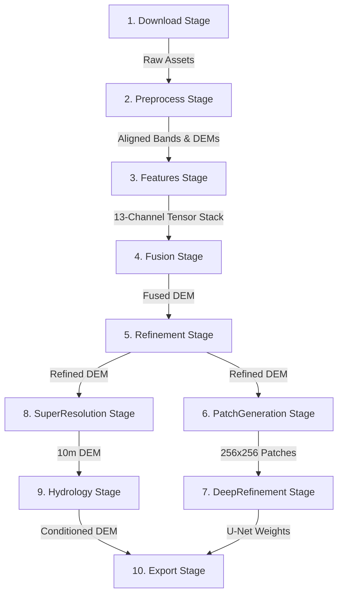

# Accurate DEM Fusion Pipeline

An advanced, automated architecture for the generation of high-precision Digital Elevation Models (DEMs) through multi-source data fusion, machine learning refinement, and hydrological conditioning.

---

## Project Overview

This pipeline addresses the limitations of individual spaceborne DEMs (like Copernicus GLO-30 or FABDEM) by fusing them using geomorphological weighting and refining the result against NASA ICESat-2 LiDAR ground-truth data.

The project is structured around a modular, stage-based architecture orchestrated by a `PipelineRegistry`. It enforces strict Area of Interest (AOI) bounding, ensuring all processing is spatially consistent and resource-efficient.

### Key Highlights
- **13-Channel Feature Stack**: Fuses elevation, slope, aspect, hillshade, roughness, curvature, local relief, TRI, TPI, Sentinel-2 NDVI, Sentinel-1 SAR (VV/VH), and OSM Building Masks.
- **Geomorphological Weighting**: Adapts fusion weights based on slope, prioritizing Copernicus on steep slopes and FABDEM on flat ground.
- **Calibrated Machine Learning**: Features Random Forest error regression utilizing robust safeguards: mean-neutral NaN handling, DEM column amplification, magnitude clamping, and physics-informed constraints (for buildings and vegetation canopy).
- **Spatial Deep Learning (Phase 3)**: Extracted 256x256 spatial patches centered around ground-truth coordinates, supporting training of a lightweight PyTorch U-Net.
- **10m Super-Resolution**: Uses Sentinel-2 optical and Sentinel-1 SAR bands as structural guides to upscale the 30m DEM output to a 10m grid.
- **Hydrological Conditioning**: Employs `WhiteboxTools` Fast Depression Breaching for continuous surface water flow.

---

## Workflow Architecture

The pipeline processes input data through 10 registered stages:



---

## Pipeline Stages Detail

### 1. Download Stage (`DownloadManager`)
Autonomously retrieves and caches spatial data over the defined Area of Interest (AOI):
- **Copernicus GLO-30**: Retrieved via the Microsoft Planetary Computer (STAC API).
- **FABDEM V1.2**: Forest-and-building-removed version of Copernicus, loaded via `FabdemLoader`.
- **NASA ICESat-2 (ATL08)**: Bare-earth altimetry tracks fetched via `earthaccess`.
- **Sentinel-2 L2A**: Optical imagery bands (B04 - Red & B08 - NIR) for NDVI computing.
- **Sentinel-1 RTC**: GRD radar backscatter (VV & VH polarization) for surface texture intelligence.
- **Building Footprints**: OSM building footprints fetched via Overpass API.

### 2. Preprocess Stage
Performs spatial alignment and rasterization:
- **Nuth & Kääb 3D Co-registration**: Sub-pixel 3D alignment of FABDEM to the baseline Copernicus DEM using `xdem` to remove systematic translational offsets.
- **Satellite Processing**: Sentinel-1 and Sentinel-2 bands are reprojected and resampled to the DEM grid using `rasterio.warp.reproject`.
- **Urban Rasterization**: Vector building footprints are rasterized into a pixel-aligned binary mask using `rasterio.features.rasterize`.

### 3. Features Stage (`FeatureEngine`)
Constructs a 13-channel normalized NumPy tensor (`feature_stack_normalized.npy`) consisting of:
1. **Elevation**: Baseline terrain height.
2. **Slope**: Surface steepness in degrees.
3. **Aspect**: Slope orientation in degrees.
4. **Hillshade**: Shaded relief visualization.
5. **Roughness**: Difference between local maximum and minimum filter in a 3x3 window.
6. **Curvature**: Laplace operator representing the rate of change of slope.
7. **Local Relief**: Surface height relative to a local mean filter.
8. **TRI**: Terrain Ruggedness Index calculated using standard deviation in a 3x3 window.
9. **TPI**: Topographic Position Index representing hills vs. valleys.
10. **NDVI**: Vegetation density index computed from S2 bands.
11. **SAR VV**: Radar backscatter in VV polarization.
12. **SAR VH**: Radar backscatter in VH polarization.
13. **Building Mask**: Binary structural footprints.

### 4. Fusion Stage (`FusionEngine`)
Blends Copernicus and aligned FABDEM adaptively using slope as a geomorphological weight:
$$\text{Fused DEM} = w_{\text{cop}} \cdot \text{Copernicus} + (1 - w_{\text{cop}}) \cdot \text{FABDEM}$$
Where $w_{\text{cop}}$ scales linearly from $0.0$ (flat) to $1.0$ (slopes $\ge 30^\circ$). This preserves high-slope topographic structure (Copernicus) while leveraging canopy-and-building-removed heights on flat plains (FABDEM).

### 5. Refinement Stage (`MLEngine`)
Trains a Spatial Random Forest Regressor on the residuals between the Fused DEM and ICESat-2 LiDAR coordinates, utilizing the following calibration safeguards:
- **NaN Handling**: Replaces missing satellite observations with mean-neutral $0.0$ in the normalized stack to prevent data loss.
- **DEM Amplification**: Duplicates the DEM channel 3x to ensure terrain structure guides the model (guaranteeing $\ge 40\%$ combined importance).
- **Correction Damping**: Scales predicted corrections by $0.5$ to prevent over-adjustment and maintain baseline terrain consistency.
- **Magnitude Clamping**: Limits single-pixel correction values to $3\sigma$ of the observed residuals in the training set.
- **Physics-Informed Clamping**: Enforces a hard physical constraint where corrections in pixels containing buildings (Mask == 1) or dense canopy (NDVI > 0.5) cannot be positive (since trees and buildings only increase DSM heights, they do not dig holes).

### 6. PatchGeneration Stage (`PatchGenerator`)
Extracts $256 \times 256$ spatial patches centered around the ICESat-2 ground-truth coordinates. These patches transform the continuous 13-channel stack into a discrete deep learning dataset (`cnn_patches_X.npy` and `cnn_patches_y.npy`).

### 7. DeepRefinement Stage (`DeepRefiner`)
Consumes the extracted 256x256 patches to train a lightweight **PyTorch U-Net architecture** on a CUDA-enabled GPU. The model learns complex spatial and biological error patterns, supervising the center pixel against point residuals to output a spatial elevation correction map.

### 8. SuperResolution Stage (`SuperResUpscaler`)
Upscales the refined 30m DEM output to a high-resolution 10m grid:
1. **Baseline Upsampling**: Performs cubic-spline interpolation of the 30m DEM to a 10m grid.
2. **Structural Guides**: Pulls native 10m Sentinel-2 NDVI and Sentinel-1 SAR (VH) bands.
3. **High-Frequency Details**: Extracts high-frequency texture details by subtracting a Gaussian-smoothed (sigma=1.0) guide from the original, and blends them into the cubic-spline baseline.

### 9. Hydrology Stage (`HydroConditioner`)
Uses the `WhiteboxTools` Rust binary to perform **Fast Depression Breaching** on the super-resolved DEM, ensuring continuous flow paths and resolving artificial depressions for drainage and flood modeling.

### 10. Export Stage (`Exporter`)
Aggregates and saves the final outputs into the `output/` directory:
- **Final DEM (`final_dem.tif`)**: Hydrologically conditioned high-precision terrain model.
- **Confidence Map (`confidence.tif`)**: Spatial uncertainty computed via standard deviation of Random Forest tree predictions.
- **Metadata (`metadata.json`)**: Processing history, AOI bounds, and model feature importances.
- **Quality Report (`quality_report.pdf`)**: Side-by-side plot comparing the final elevation map and ML uncertainty.

---

## Directory Structure

```
accurate_dem/
│
├── src/
│   ├── cache/                  # Cache management and hashing utilities
│   ├── core/                   # Context, AOI definitions, and Pipeline Stage orchestration
│   ├── download/               # APIs for planetary, FABDEM, OSM, and ICESat-2 downloads
│   ├── features/               # Terrain computation, normalization, and feature stacking
│   ├── fusion/                 # Geomorphological adaptive weighting fusion
│   ├── ml/                     # Random Forest, patch generation, and PyTorch U-Net
│   ├── preprocessing/          # 3D coregistration, satellite alignment, and super-resolution
│   ├── export/                 # Final artifact saving and diagnostic PDF generator
│   └── utils/                  # Shared helper scripts
│
├── configs/                    # YAML configuration files
├── output/                     # Exported DEMs, confidence maps, metadata, and PDF reports
├── tests/                      # Unit and integration test suites
│
├── run.py                      # Main entrypoint script (cleans cache & runs pipeline)
├── cli.py                      # Command-line interface for the pipeline
└── test_dataset.py             # Test script for feature stack verification
```

---

## Execution Guide

### Prerequisites
- Python 3.10+
- [WhiteboxTools](https://www.whiteboxtools.com/) binary (must be installed on the system PATH).
- NASA Earthdata Account (register at [NASA Earthdata](https://urs.earthdata.nasa.gov/)).

### Secure Authentication
Create a `.env` file in the project root containing your NASA credentials to bypass interactive prompts:
```env
EARTHDATA_USERNAME=your_username
EARTHDATA_PASSWORD=your_password
```

### Installation
Clone the repository and install dependencies:
```bash
pip install -r requirements.txt
```
*Note: To train the Phase 3 U-Net model on GPU, install PyTorch with CUDA support (e.g. `pip install torch --index-url https://download.pytorch.org/ml/cu121`).*

### Running the Pipeline
Run the main script to clear the processed cache and execute all 10 stages:
```bash
python run.py
```
To run tests verifying the feature stack:
```bash
python test_dataset.py
```

