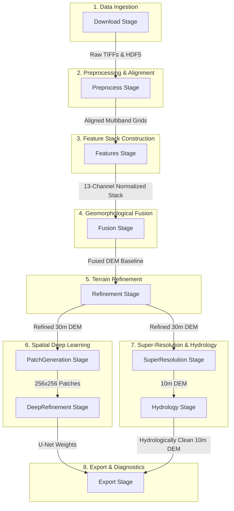

<h1 align="center">🏔️ Accurate DEM Fusion Pipeline</h1>

<div align="center">
  
  
  
  
</div>

<p align="center">
  <strong>An advanced, automated architecture for the generation of high-precision Digital Elevation Models (DEMs) through multi-source data fusion, machine learning refinement, spatial super-resolution, and hydrological conditioning.</strong>
</p>

---

## 📑 Table of Contents
- [Project Overview](#-project-overview)
- [Current Project State & Roadmap](#-current-project-state--roadmap)
- [Architecture & Coding Rules](#-architecture--coding-rules)
- [Global Workflow Stages](#-global-workflow-stages)
- [Directory & Folder Structure](#-directory--folder-structure)
- [Excruciatingly Detailed File Breakdown](#-excruciatingly-detailed-file-breakdown)
- [Third-Party Libraries](#-third-party-libraries)
- [Quick Start Guide](#-quick-start-guide)

---

## 🌍 Project Overview

This pipeline addresses the physical limitations and errors of individual spaceborne DEM products. It builds a **13-Channel Geomorphological and Environmental Tensor Stack**, aligns all inputs to a strictly bounded target Area of Interest (AOI), executes adaptive fusion, refines the topography using NASA's ICESat-2 LiDAR observations via a Random Forest model, upscales the output to 10m using satellite guides, and conditions the terrain for hydrological flow.

---

## 🚀 Current Project State & Roadmap

**Phases 1 & 2 Implementation is complete.** We are currently in a **Diagnostic & Calibration Phase**. 

The recent transition to the 13-channel stack introduced a systematic positive bias (making the final DEM higher than the original). This is highly indicative of NoData (`-9999.0`) leakage during feature normalization and an absence of physical constraints in the ML predictions.

### 🎯 Immediate Next Goals (Model Calibration & Physics Constraints)
Before attempting Deep Learning (Phase 3), we must stabilize the Random Forest:
1. **Fix the Normalizer:** Aggressively replace all NoData variants with `np.nan` BEFORE calculating statistics in [normalizer.py](file:///D:/NHPC/accurate_dem/src/features/normalizer.py).
2. **Feature Importance:** Audit what the model is learning by calculating and exporting `rf.feature_importances_` to `metadata.json` in [predictor.py](file:///D:/NHPC/accurate_dem/src/ml/predictor.py).
3. **Physics-Informed Clamping:** Enforce a hard physical rule in [predictor.py](file:///D:/NHPC/accurate_dem/src/ml/predictor.py)—if a pixel has a Building Mask == 1 or high NDVI, the predicted error *cannot* be positive (trees and buildings only increase DSM height, they don't dig holes).

---

## 🏗️ Architecture & Coding Rules

1. **AOI-Centric:** All operations must be strictly bounded by the [AreaOfInterest](file:///D:/NHPC/accurate_dem/src/core/aoi.py). Calculations, reprojections, and alignments are relative to this bounding box.
2. **Strict Caching:** Always check `.exists()` before running expensive operations to utilize the [CacheManager](file:///D:/NHPC/accurate_dem/src/cache/cache_manager.py). STAC downloads and heavy calculations are cached based on coordinate/config MD5 hash.
3. **Pipeline Registry:** All new functionality must be registered as a `PipelineStage` in [pipeline.py](file:///D:/NHPC/accurate_dem/src/core/pipeline.py) to maintain separation of concerns.
4. **Absolute Paths:** When using external binaries like the `WhiteboxTools` Rust executor, always use `.resolve()` on `pathlib.Path` objects.
5. **Masking Hygiene (CRITICAL):** Never normalize or train on NoData values. Always explicitly mask `-9999.0` and `0.0` (where appropriate) before applying `np.nanmean`, `np.nanstd`, or passing data to `sklearn`.

---

## ⚙️ Global Workflow Stages

The pipeline coordinates the flow of topographic and environmental data through **10 sequential pipeline stages**:



---

## 📂 Directory & Folder Structure

```text
accurate_dem/
├── cache/                      # Global cache store
│   ├── raw/                    # Untouched STAC tiles, HDF5 tracks, and geojson
│   └── processed/              # Normalized tensors, aligned bands, and models
├── output/                     # Final exported files (DEMs, metadata, reports)
├── src/                        # Core codebase
│   ├── cache/                  # Caching managers and hashing utilities
│   ├── core/                   # Pipeline execution framework and state contexts
│   ├── download/               # Multi-source API downloaders
│   ├── export/                 # Output formats and PDF visualization generators
│   ├── features/               # Feature extraction and normalizer engines
│   ├── fusion/                 # Slope-based adaptive weighting fusion engine
│   ├── ml/                     # RF regressor, patch generators, and U-Net refiner
│   └── preprocessing/          # Reprojections, co-registration, and upscalers
├── run.py                      # Main entrypoint script
├── tes_planetary.py            # STAC API search validator script
└── test_dataset.py             # Feature normalization and patch test script
```

---

## 🔍 Excruciatingly Detailed File Breakdown

### 📁 `src/cache`
**Purpose**: Manages filesystem caching. Stores raw and processed datasets under hash-based subdirectory pathways.
* [hash.py](file:///D:/NHPC/accurate_dem/src/cache/hash.py): Serializes AOI and config into JSON, generating an MD5 hex digest.
* [cache_manager.py](file:///D:/NHPC/accurate_dem/src/cache/cache_manager.py): Orchestrates paths for raw and intermediate files, exposing `exists()` and `path()` functions.

### 📁 `src/core`
**Purpose**: Defines the area of interest, shared execution context, pipeline registry, and execution order.
* [aoi.py](file:///D:/NHPC/accurate_dem/src/core/aoi.py): Defines spatial boundaries and calculates UTM zones.
  $$\text{Zone} = \left\lfloor \frac{\text{Center Longitude} + 180}{6} \right\rfloor + 1$$
* [context.py](file:///D:/NHPC/accurate_dem/src/core/context.py): Shared dictionary-based runtime context for data and paths.
* [stage.py](file:///D:/NHPC/accurate_dem/src/core/stage.py): Wrapper for individual pipeline steps, handling stdout logging.
* [pipeline_registry.py](file:///D:/NHPC/accurate_dem/src/core/pipeline_registry.py): Tracks and executes registered stages sequentially.
* [pipeline.py](file:///D:/NHPC/accurate_dem/src/core/pipeline.py): Instantiates managers, registers the 10 stages, and drives execution.

### 📁 `src/download`
**Purpose**: Ingests remote topographic, environmental, and validation data.
* [download_manager.py](file:///D:/NHPC/accurate_dem/src/download/download_manager.py): Central entry point that invokes individual loaders.
* [planetary_loader.py](file:///D:/NHPC/accurate_dem/src/download/planetary_loader.py): Connects to Microsoft Planetary Computer STAC for Copernicus, Sentinel-2, Sentinel-1, and OSM Overpass.
* [fabdem_loader.py](file:///D:/NHPC/accurate_dem/src/download/fabdem_loader.py): Retrieves FABDEM tiles.
* [lidar_loader.py](file:///D:/NHPC/accurate_dem/src/download/lidar_loader.py): Authenticates via `earthaccess` to download NASA ICESat-2 (ATL08) tracks and parse HDF5 files.
* [ground_truth_api.py](file:///D:/NHPC/accurate_dem/src/download/ground_truth_api.py): Fallback ground-truth generator querying Open-Meteo REST API.

### 📁 `src/preprocessing`
**Purpose**: Formatting, transformations, alignment, vector rasterization, upscaling, and conditioning.
* [copernicus_processor.py](file:///D:/NHPC/accurate_dem/src/preprocessing/copernicus_processor.py): Merges Copernicus DEM tiles and clips to bounds.
* [reproject.py](file:///D:/NHPC/accurate_dem/src/preprocessing/reproject.py): Projects datasets to local UTM grids.
* [coregistration.py](file:///D:/NHPC/accurate_dem/src/preprocessing/coregistration.py): Computes Nuth & Kääb (2011) translations to align FABDEM to Copernicus.
* [satellite_processor.py](file:///D:/NHPC/accurate_dem/src/preprocessing/satellite_processor.py): Calculates NDVI and aligns SAR bands.
  $$\text{NDVI} = \frac{\text{NIR} - \text{Red}}{\text{NIR} + \text{Red}}$$
* [urban_processor.py](file:///D:/NHPC/accurate_dem/src/preprocessing/urban_processor.py): Converts OSM building geometries into rasterized masks.
* [super_resolution.py](file:///D:/NHPC/accurate_dem/src/preprocessing/super_resolution.py): Upsamples DEM to 10m using cubic-spline and injects high-frequency details from Sentinel guides.
  $$\text{Detail} = \text{Guide} - \text{GaussianFilter}(\text{Guide}, \sigma=1.0)$$
  $$\text{DEM}_{10\text{m}} = \text{CubicDEM} + (\text{Detail} \cdot 0.15)$$
* [hydro_conditioning.py](file:///D:/NHPC/accurate_dem/src/preprocessing/hydro_conditioning.py): Enforces continuous flow using WhiteboxTools' Fast Depression Breaching.

### 📁 `src/features`
**Purpose**: Generates topographic features and normalizes the stack.
* [terrain.py](file:///D:/NHPC/accurate_dem/src/features/terrain.py): Computes geomorphological indices (Slope, Aspect, Curvature, TRI, TPI, etc.).
  $$\text{TRI} = \sqrt{\max(\text{Mean}(\text{DEM}^2) - \text{Mean}(\text{DEM})^2, 0)}$$
* [feature_engine.py](file:///D:/NHPC/accurate_dem/src/features/feature_engine.py): Stacks DEM, terrain indices, NDVI, SAR, and Building Mask into a 13-channel numpy array.
* [normalizer.py](file:///D:/NHPC/accurate_dem/src/features/normalizer.py): Standardizes features, aggressively masking NoData values.

### 📁 `src/fusion`
**Purpose**: Blends different DEM products.
* [fusion_engine.py](file:///D:/NHPC/accurate_dem/src/fusion/fusion_engine.py): Computes slope-based weights to dynamically blend Copernicus DEM with FABDEM.
  $$w_{\text{cop}} = \text{clip}\left(\frac{\text{Slope}}{30.0}, 0.0, 1.0\right)$$
  $$\text{Fused DEM} = w_{\text{cop}} \cdot \text{Copernicus} + (1.0 - w_{\text{cop}}) \cdot \text{FABDEM}$$

### 📁 `src/ml`
**Purpose**: Models topography errors and deep learning refinement.
* [dataset.py](file:///D:/NHPC/accurate_dem/src/ml/dataset.py): Memory-mapped tensor interface for reading the 13-channel stack.
* [predictor.py](file:///D:/NHPC/accurate_dem/src/ml/predictor.py): Trains Random Forest regressor, applies corrections, estimates uncertainty, and enforces physics-informed clamps.
  $$\text{Correction} = \min(\text{Correction}, 0.0) \quad \text{if } \text{BuildingMask} = 1 \text{ or } \text{NDVI} > 0.5$$
  $$\text{Uncertainty} = \text{std}(\{T_k(X)\}_{k=1}^{30})$$
* [patch_generator.py](file:///D:/NHPC/accurate_dem/src/ml/patch_generator.py): Generates 256x256 spatial training patches.
* [deep_refiner.py](file:///D:/NHPC/accurate_dem/src/ml/deep_refiner.py): Trains a PyTorch U-Net for spatial deep learning refinement.

### 📁 `src/export`
**Purpose**: Final data formatting and diagnostics.
* [exporter.py](file:///D:/NHPC/accurate_dem/src/export/exporter.py): Copies GeoTIFFs, writes JSON metadata, and plots a two-panel PDF diagnostic report.

### 📄 Root Scripts
* [run.py](file:///D:/NHPC/accurate_dem/run.py): The main entrypoint. Configures UTF-8, clears caches, sets the AOI, and triggers the pipeline.
* [test_dataset.py](file:///D:/NHPC/accurate_dem/test_dataset.py): A development script to validate patch generation and feature normalization on a test AOI.
* [tes_planetary.py](file:///D:/NHPC/accurate_dem/tes_planetary.py): Tool to validate Microsoft Planetary Computer STAC connectivity.

---

## 🛠️ Third-Party Libraries

| Library | Core Purpose in the Pipeline |
| :--- | :--- |
| **WhiteboxTools** | Fast Depression Breaching in `hydro_conditioning.py` |
| **earthaccess** | Authenticates NASA Earthdata credentials to download ICESat-2 tracks |
| **xdem** | Coregisters DEMs using Nuth & Kääb translation algorithms |
| **rasterio** | Reads/writes GeoTIFFs, reprojects rasters, and clips bounds |
| **scipy** | Computes geomorphological features and high-pass filters |
| **pandas / numpy** | Data management, multi-dimensional array processing, masking |
| **geopandas / shapely** | Parses vector files, reconstructs geometries, clips to bounds |
| **matplotlib** | Plots elevation maps and PDF quality reports |
| **pyproj** | CRS and projection conversions |
| **PyTorch** | Trains U-Net deep learning models on CUDA GPUs |

---

## ⚡ Quick Start Guide

### Prerequisites
* **Python 3.10+**
* **WhiteboxTools** binary (installed and added to your system PATH).
* **NASA Earthdata Account** (Register at [NASA Earthdata](https://urs.earthdata.nasa.gov/)).

### Configuration
Create a `.env` file in the project root containing your NASA Earthdata credentials:
```env
EARTHDATA_USERNAME=your_username
EARTHDATA_PASSWORD=your_password
```

### Installation
1. Install standard dependencies:
   ```bash
   pip install -r requirements.txt
   ```
2. *(Optional)* Install PyTorch with CUDA support for Deep Learning refinement:
   ```bash
   pip install torch --index-url https://download.pytorch.org/ml/cu121
   ```

### Execution
Run the full pipeline on the default Area of Interest:
```bash
python run.py
```
Run the test suite to verify feature stacks and patches:
```bash
python test_dataset.py
```

---
<p align="center"><i>Maintained with ❤️ by the Accurate DEM Team</i></p>
