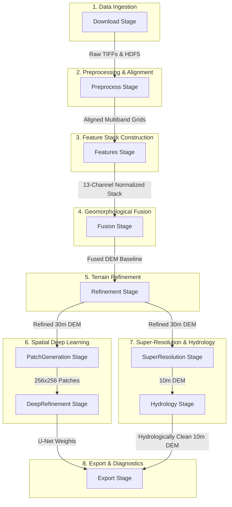

# Accurate DEM Fusion Pipeline

An advanced, automated architecture for the generation of high-precision Digital Elevation Models (DEMs) through multi-source data fusion, machine learning refinement, spatial super-resolution, and hydrological conditioning.

---

## 1. Project-Wide Architecture & Philosophy

This pipeline addresses the physical limitations and errors of individual spaceborne DEM products. It builds a **13-Channel Geomorphological and Environmental Tensor Stack**, aligns all inputs to a strictly bounded target Area of Interest (AOI), executes adaptive fusion, refines the topography using NASA's ICESat-2 LiDAR observations via a Random Forest model, upscales the output to 10m using satellite guides, and conditions the terrain for hydrological flow.

### Core Architectural Rules
1. **AOI-Centric Bounding**: All operations are spatial boundaries bounded by the defined `AreaOfInterest`. Calculations, reprojections, and alignments are performed relative to this bounding box.
2. **Strict Cache Hygiene**: Expensive STAC downloads and heavy calculations are cached based on the coordinate and configuration MD5 hash.
3. **Pipeline Stages Registry**: Every processing phase is isolated and registered as a `PipelineStage` on a global registry to maintain separation of concerns.
4. **Absolute Pathing**: External binaries (specifically the `WhiteboxTools` Rust executor) require absolute path resolution (`.resolve()`) to prevent filesystem context losses.
5. **Masking Hygiene**: NoData values (`-9999.0` or `< -500`) are aggressively replaced with `np.nan` before computing statistical moments (means, standard deviations) and training models to prevent leakage.

---

## 2. Global Workflow Stages

The pipeline coordinates the flow of topographic and environmental data through **10 sequential pipeline stages**:



---

## 3. Directory & Folder Structure Details

Below is the structured layout of the project:

```
accurate_dem/
│
├── cache/                      # Global cache store
│   ├── raw/                    # Untouched STAC tiles, HDF5 track downloads, and geojson files
│   └── processed/              # Normalized tensors, aligned bands, and model files
│
├── output/                     # Final exported files (DEMs, confidence maps, metadata, reports)
│
├── src/                        # Core codebase
│   ├── cache/                  # Caching managers and md5 hashing utilities
│   ├── core/                   # Pipeline execution framework and state contexts
│   ├── download/               # Multi-source API downloaders
│   ├── export/                 # Final format conversion and PDF visualization generators
│   ├── features/               # Geomorphological feature extraction and normalizer engines
│   ├── fusion/                 # Slope-based adaptive weighting fusion engine
│   ├── ml/                     # Random Forest regressor, patch generators, and U-Net refiner
│   └── preprocessing/          # Reprojections, co-registration, and super-resolution upscalers
│
├── run.py                      # Main entrypoint script
├── tes_planetary.py            # STAC API search validator script
└── test_dataset.py             # Feature normalization and patch test script
```

---

## 4. Excruciatingly Detailed Directory & File Breakdown

---

### Folder: `src/cache`
* **Folder Purpose**: Manages filesystem caching. It provides a structured caching layer to store raw and processed datasets under subdirectory pathways named with a unique hash.
* **How Files Work Together**: [hash.py](file:///D:/NHPC/accurate_dem/src/cache/hash.py) provides a utility function to compute a hash representing the coordinates and configurations. [cache_manager.py](file:///D:/NHPC/accurate_dem/src/cache/cache_manager.py) uses this hash to create path variables and check for existing files before performing downloads or computations.

#### [cache_manager.py](file:///D:/NHPC/accurate_dem/src/cache/cache_manager.py)
* **Role**: Orchestrates paths for raw downloads (`cache/raw/<hash>`) and intermediate files (`cache/processed/<hash>`).
* **Implementation Details**:
  * Exposes `exists(aoi, filename, processed)` to check if a specific output was already calculated.
  * Exposes `path(aoi, filename, processed)` to return a path object for target files.
  * Houses helper directories definitions `raw` and `processed`.

#### [hash.py](file:///D:/NHPC/accurate_dem/src/cache/hash.py)
* **Role**: Computes deterministic identifiers for caching keys.
* **Implementation Details**:
  * Implements `generate_hash(aoi, config)`.
  * Serializes a dictionary containing the AOI bounding box coordinates (`aoi.bbox`) and configuration dictionaries (`config`) into sorted-key JSON strings.
  * Generates an MD5 hex digest from the JSON string.

---

### Folder: `src/core`
* **Folder Purpose**: Contains core pipeline modules. It defines the area of interest, shared execution context, stage representations, registry, and the pipeline execution order.
* **How Files Work Together**:
  * [aoi.py](file:///D:/NHPC/accurate_dem/src/core/aoi.py) defines the spatial boundaries.
  * [context.py](file:///D:/NHPC/accurate_dem/src/core/context.py) provides a shared store for data and file paths.
  * [stage.py](file:///D:/NHPC/accurate_dem/src/core/stage.py) wraps individual pipeline functions.
  * [pipeline_registry.py](file:///D:/NHPC/accurate_dem/src/core/pipeline_registry.py) manages execution sequences.
  * [pipeline.py](file:///D:/NHPC/accurate_dem/src/core/pipeline.py) orchestrates the entire sequence by calling classes from other directories.

#### [aoi.py](file:///D:/NHPC/accurate_dem/src/core/aoi.py)
* **Role**: Defines spatial limits and coordinate reference systems.
* **Implementation Details**:
  * Dataclass `AreaOfInterest` holding `min_lon`, `min_lat`, `max_lon`, and `max_lat`.
  * Computes standard bounding box tuple `bbox` and Shapely `polygon` for clipping.
  * Generates a coordinate-specific MD5 `hash`.
  * Calculates the correct UTM EPSG projection code `utm_epsg` based on center coordinates.
    $$\text{Zone} = \left\lfloor \frac{\text{Center Longitude} + 180}{6} \right\rfloor + 1$$
    Returns $32600 + \text{Zone}$ for Northern Hemisphere or $32700 + \text{Zone}$ for Southern Hemisphere.

#### [context.py](file:///D:/NHPC/accurate_dem/src/core/context.py)
* **Role**: Shared dictionary-based runtime dictionary.
* **Implementation Details**:
  * Contains fields for `raw_dems`, `lidar`, `satellite` inputs, `aligned_dems`, `features` stack metadata, and output file registers.
  * Passed between stages to facilitate data sharing.

#### [stage.py](file:///D:/NHPC/accurate_dem/src/core/stage.py)
* **Role**: Isolates a single pipeline operation step.
* **Implementation Details**:
  * Instantiated with a name and function pointer.
  * Runs the function wrapper and logs a formatted header to stdout.

#### [pipeline_registry.py](file:///D:/NHPC/accurate_dem/src/core/pipeline_registry.py)
* **Role**: Tracks and executes registered stages.
* **Implementation Details**:
  * Collects `PipelineStage` objects in a list.
  * Iterates through the list and executes each sequentially.

#### [pipeline.py](file:///D:/NHPC/accurate_dem/src/core/pipeline.py)
* **Role**: Connects all subsystems.
* **Implementation Details**:
  * Instantiates the context, cache manager, download manager, coregistrator, processors, engines, and upscalers.
  * Registers 10 stages (`Download`, `Preprocess`, `Features`, `Fusion`, `Refinement`, `PatchGeneration`, `DeepRefinement`, `SuperResolution`, `Hydrology`, `Export`).
  * Implements stage-specific wrapper functions (e.g. `download()`, `preprocess()`) which extract file paths from the shared context, execute operations, and store updated intermediate paths back into the context.

---

### Folder: `src/download`
* **Folder Purpose**: Ingests remote data, querying and downloading topographic, environmental, and validation coordinates.
* **How Files Work Together**: [download_manager.py](file:///D:/NHPC/accurate_dem/src/download/download_manager.py) coordinates downloads by invoking loaders: [planetary_loader.py](file:///D:/NHPC/accurate_dem/src/download/planetary_loader.py) for STAC catalog queries (Copernicus, Sentinel-1, Sentinel-2) and Overpass OSM queries; [fabdem_loader.py](file:///D:/NHPC/accurate_dem/src/download/fabdem_loader.py) for FABDEM; [lidar_loader.py](file:///D:/NHPC/accurate_dem/src/download/lidar_loader.py) for ICESat-2; and [ground_truth_api.py](file:///D:/NHPC/accurate_dem/src/download/ground_truth_api.py) for Open-Meteo REST samples.

#### [download_manager.py](file:///D:/NHPC/accurate_dem/src/download/download_manager.py)
* **Role**: Central entry point for downloading.
* **Implementation Details**:
  * Resolves raw caching directories.
  * Calls individual download methods, catches exceptions, prints summaries, and outputs a dictionary of downloaded file paths.

#### [planetary_loader.py](file:///D:/NHPC/accurate_dem/src/download/planetary_loader.py)
* **Role**: Interacts with STAC catalogs and APIs.
* **Implementation Details**:
  * Opens connection to the Microsoft Planetary Computer STAC catalog, signing URLs using `planetary_computer.sign_inplace`.
  * Searches `cop-dem-glo-30` for Copernicus elevations.
  * Searches `sentinel-2-l2a` for cloud cover < 10%, downloading bands B04 (Red) and B08 (NIR).
  * Searches `sentinel-1-rtc` (Radiometric Terrain Corrected) for VV and VH polarizations.
  * Implements OSM Overpass API queries, requesting building footprints inside the bbox and exporting raw JSON elements.

#### [fabdem_loader.py](file:///D:/NHPC/accurate_dem/src/download/fabdem_loader.py)
* **Role**: Retrieves FABDEM tiles (Copernicus DEM corrected for forest and building canopy height biases).
* **Implementation Details**:
  * Queries and downloads data using the `fabdem` library. Falls back to a warning log if the library is not installed.

#### [lidar_loader.py](file:///D:/NHPC/accurate_dem/src/download/lidar_loader.py)
* **Role**: Downloads and parses NASA ICESat-2 LiDAR elevation tracks.
* **Implementation Details**:
  * Authenticates using `earthaccess` with credentials from `.env` or netrc.
  * Searches for `ATL08` (Land and Vegetation altimetry) granules intersecting the AOI.
  * Downloads HDF5 track files.
  * Parses HDF5 datasets for all 6 laser beams (`gt1l`, `gt1r`, `gt2l`, `gt2r`, `gt3l`, `gt3r`).
  * Extracts coordinates and bare-earth elevation data (`h_te_best_fit`), filters clouds (elevations > 10,000m), clips to the AOI boundaries, removes duplicate footprints, and writes outputs to a CSV file.

#### [ground_truth_api.py](file:///D:/NHPC/accurate_dem/src/download/ground_truth_api.py)
* **Role**: Fallback ground-truth generator.
* **Implementation Details**:
  * Generates random coordinate points within the boundaries of the AOI.
  * Sends requests to the Open-Meteo Elevation REST API to retrieve true elevations, saving them as a CSV file.

---

### Folder: `src/preprocessing`
* **Folder Purpose**: Performs spatial formatting, coordinate transformations, raster alignments, vector rasterization, upscaling, and conditioning.
* **How Files Work Together**:
  * [copernicus_processor.py](file:///D:/NHPC/accurate_dem/src/preprocessing/copernicus_processor.py) merges Copernicus DEM tiles into a single grid.
  * [reproject.py](file:///D:/NHPC/accurate_dem/src/preprocessing/reproject.py) projects the grid to UTM.
  * [coregistration.py](file:///D:/NHPC/accurate_dem/src/preprocessing/coregistration.py) coregisters FABDEM to the Copernicus grid.
  * [satellite_processor.py](file:///D:/NHPC/accurate_dem/src/preprocessing/satellite_processor.py) processes NDVI and SAR bands.
  * [urban_processor.py](file:///D:/NHPC/accurate_dem/src/preprocessing/urban_processor.py) rasterizes building footprints.
  * [super_resolution.py](file:///D:/NHPC/accurate_dem/src/preprocessing/super_resolution.py) upscales output to 10m.
  * [hydro_conditioning.py](file:///D:/NHPC/accurate_dem/src/preprocessing/hydro_conditioning.py) cleans the terrain using Rust binaries.

#### [copernicus_processor.py](file:///D:/NHPC/accurate_dem/src/preprocessing/copernicus_processor.py)
* **Role**: Merges and crops downloaded tiles.
* **Implementation Details**:
  * Opens multi-tile files and mosaics them into a single array using `rasterio.merge.merge`.
  * Clips the raster using `rasterio.windows.from_bounds` to match the target bounding box coordinates.

#### [reproject.py](file:///D:/NHPC/accurate_dem/src/preprocessing/reproject.py)
* **Role**: Projects datasets to local metric grids.
* **Implementation Details**:
  * Reprojects layers into local UTM zones.
  * Calculates transformations using `calculate_default_transform` and writes reprojected bands using bilinear interpolation.

#### [coregistration.py](file:///D:/NHPC/accurate_dem/src/preprocessing/coregistration.py)
* **Role**: Co-registers elevation models in 3D.
* **Implementation Details**:
  * Employs the Nuth and Kääb (2011) algorithm via `xdem.coreg.NuthKaab` to compute horizontal and vertical translations, aligning FABDEM to Copernicus reference DEMs.

#### [satellite_processor.py](file:///D:/NHPC/accurate_dem/src/preprocessing/satellite_processor.py)
* **Role**: Formats Sentinel data.
* **Implementation Details**:
  * `NDVIProcessor` reads Red (B04) and NIR (B08) bands, computes NDVI:
    $$\text{NDVI} = \frac{\text{NIR} - \text{Red}}{\text{NIR} + \text{Red}}$$
    and reprojects it to the target UTM DEM grid (handling division-by-zero, clipping to $[-1.0, 1.0]$, and using nodata value `-9999.0`).
  * `SARProcessor` aligns Sentinel-1 VV and VH backscatter bands to the target UTM grid.

#### [urban_processor.py](file:///D:/NHPC/accurate_dem/src/preprocessing/urban_processor.py)
* **Role**: Handles building geometries.
* **Implementation Details**:
  * Loads OSM building coordinates from JSON.
  * Reconstructs polygons from nodes and ways using Shapely, and clips them to the boundaries of the AOI.
  * Reprojects geometries to the target UTM coordinate system.
  * Rasterizes vector polygons into a binary building footprint mask using `rasterio.features.rasterize`.

#### [super_resolution.py](file:///D:/NHPC/accurate_dem/src/preprocessing/super_resolution.py)
* **Role**: Performs super-resolution upscaling to a 10m grid.
* **Implementation Details**:
  * Upsamples the 30m refined DEM using cubic-spline interpolation to a 10m grid.
  * Aligns 10m Sentinel-2 bands and Sentinel-1 SAR VH bands to the 10m grid.
  * Normalizes and averages the bands to build a combined guide.
  * Extracts high-frequency details using a high-pass filter:
    $$\text{Detail} = \text{Guide} - \text{GaussianFilter}(\text{Guide}, \sigma=1.0)$$
  * Injects details into the upsampled DEM baseline:
    $$\text{DEM}_{10\text{m}} = \text{CubicDEM} + (\text{Detail} \cdot 0.15)$$

#### [hydro_conditioning.py](file:///D:/NHPC/accurate_dem/src/preprocessing/hydro_conditioning.py)
* **Role**: Enforces continuous flow.
* **Implementation Details**:
  * Uses the `whitebox` wrapper to execute WhiteboxTools' Fast Depression Breaching.
  * Converts relative path strings to absolute paths using `.resolve()` and runs `breach_depressions` to clean depressions and pits.

---

### Folder: `src/features`
* **Folder Purpose**: Generates topographic features and normalizes the multi-source stack.
* **How Files Work Together**:
  * [terrain.py](file:///D:/NHPC/accurate_dem/src/features/terrain.py) computes geomorphological indices.
  * [feature_engine.py](file:///D:/NHPC/accurate_dem/src/features/feature_engine.py) stacks these indices with Sentinel layers and building masks.
  * [normalizer.py](file:///D:/NHPC/accurate_dem/src/features/normalizer.py) normalizes the stack.

#### [terrain.py](file:///D:/NHPC/accurate_dem/src/features/terrain.py)
* **Role**: Computes geomorphological indices.
* **Implementation Details**:
  * `compute_slope` & `compute_aspect`: Calculated using Sobel filters.
  * `compute_curvature`: Calculated using Laplace filters.
  * `compute_hillshade`: Shaded relief calculated assuming sun azimuth 315° and sun altitude 45°.
  * `compute_roughness`: Difference between max and min filters in a 3x3 window.
  * `compute_local_relief`: Elevation minus local uniform mean inside a 15x15 window.
  * `compute_tri` (Terrain Ruggedness Index): Local standard deviation inside a 3x3 window:
    $$\text{TRI} = \sqrt{\max(\text{Mean}(\text{DEM}^2) - \text{Mean}(\text{DEM})^2, 0)}$$
  * `compute_tpi` (Topographic Position Index): Elevation minus uniform mean in a 3x3 window.

#### [feature_engine.py](file:///D:/NHPC/accurate_dem/src/features/feature_engine.py)
* **Role**: Builds the feature stack.
* **Implementation Details**:
  * Computes geomorphological layers and saves them as intermediate GeoTIFFs.
  * Compiles a 13-channel numpy array:
    * Channel 0: DEM Elevation
    * Channel 1: Slope
    * Channel 2: Aspect
    * Channel 3: Hillshade
    * Channel 4: Roughness
    * Channel 5: Curvature
    * Channel 6: Local Relief
    * Channel 7: TRI
    * Channel 8: TPI
    * Channel 9: NDVI
    * Channel 10: SAR VV
    * Channel 11: SAR VH
    * Channel 12: Building Mask
  * Passes the array to the normalizer and saves the output.

#### [normalizer.py](file:///D:/NHPC/accurate_dem/src/features/normalizer.py)
* **Role**: Normalizes features.
* **Implementation Details**:
  * Replaces values < -500 (NoData flags) with `np.nan`.
  * Computes mean and standard deviation per channel using `np.nanmean` and `np.nanstd`.
  * Standardizes values: $Z = \frac{X - \mu}{\sigma}$ (with division-by-zero protection).

---

### Folder: `src/fusion`
* **Folder Purpose**: Blends different DEM products.
* **How Files Work Together**: [fusion_engine.py](file:///D:/NHPC/accurate_dem/src/fusion/fusion_engine.py) reads Copernicus DEM and co-registered FABDEM, using slope weights to blend the two datasets.

#### [fusion_engine.py](file:///D:/NHPC/accurate_dem/src/fusion/fusion_engine.py)
* **Role**: Blends Copernicus and FABDEM.
* **Implementation Details**:
  * Normalizes slope values between 0.0 and 30.0 degrees to calculate Copernicus weights:
    $$w_{\text{cop}} = \text{clip}\left(\frac{\text{Slope}}{30.0}, 0.0, 1.0\right)$$
  * Calculates the blended DEM:
    $$\text{Fused DEM} = w_{\text{cop}} \cdot \text{Copernicus} + (1.0 - w_{\text{cop}}) \cdot \text{FABDEM}$$
  * Prioritizes Copernicus on slopes $\ge 30^\circ$ and FABDEM (which corrects for vegetation and building biases) on flat plains.

---

### Folder: `src/ml`
* **Folder Purpose**: Models topography errors.
* **How Files Work Together**:
  * [dataset.py](file:///D:/NHPC/accurate_dem/src/ml/dataset.py) provides memory-mapped access to features.
  * [predictor.py](file:///D:/NHPC/accurate_dem/src/ml/predictor.py) runs Random Forest regressor models.
  * [patch_generator.py](file:///D:/NHPC/accurate_dem/src/ml/patch_generator.py) generates training patches.
  * [deep_refiner.py](file:///D:/NHPC/accurate_dem/src/ml/deep_refiner.py) trains U-Net models.

#### [dataset.py](file:///D:/NHPC/accurate_dem/src/ml/dataset.py)
* **Role**: Memory-mapped stack interface.
* **Implementation Details**:
  * Reads the normalized tensor stack using `np.load(..., mmap_mode="r")` to prevent memory bottlenecks.
  * Exposes interfaces to retrieve single channels, patches, or random patches.

#### [predictor.py](file:///D:/NHPC/accurate_dem/src/ml/predictor.py)
* **Role**: Trains Random Forest regressor models and predicts elevation corrections.
* **Implementation Details**:
  * Maps ICESat-2 coordinates to pixel indices.
  * Replaces NaNs with `0.0`.
  * Duplicates the base DEM column 3x to ensure combined DEM feature importance is $\ge 40\%$.
  * Fits a `RandomForestRegressor` (`n_estimators=30`, `max_depth=6`).
  * Applies predicted corrections to the fused DEM with a damping factor of $0.5$ and clips corrections to $\pm 3\sigma$ of observed training residuals.
  * Enforces physics-informed constraints:
    $$\text{Correction} = \min(\text{Correction}, 0.0) \quad \text{if } \text{BuildingMask} = 1 \text{ or } \text{NDVI} > 0.5$$
  * Estimates spatial uncertainty (standard deviation across individual tree predictions):
    $$\text{Uncertainty} = \text{std}(\{T_k(X)\}_{k=1}^{30})$$
  * Saves outputs `final_dem.tif` and `confidence.tif`.

#### [patch_generator.py](file:///D:/NHPC/accurate_dem/src/ml/patch_generator.py)
* **Role**: Generates spatial patches.
* **Implementation Details**:
  * Extracts $256 \times 256$ spatial patches centered on ICESat-2 points.
  * Handles boundary points by padding the stack with zeros, and saves outputs to `cnn_patches_X.npy` and `cnn_patches_y.npy`.

#### [deep_refiner.py](file:///D:/NHPC/accurate_dem/src/ml/deep_refiner.py)
* **Role**: Trains a lightweight PyTorch U-Net.
* **Implementation Details**:
  * Implements `LightweightUNet` (Encoder with maxpooling, Bottleneck, Decoder with transposed convolutions and skip connections, and a final 1x1 convolution layer).
  * Supervises model predictions at the center pixel:
    $$\text{Loss} = \text{MSE}(\hat{y}[128, 128], y_{\text{true}})$$
  * Trains using the Adam optimizer and saves model weights.

---

### Folder: `src/export`
* **Folder Purpose**: Prepares final data formats and reports.
* **How Files Work Together**: [exporter.py](file:///D:/NHPC/accurate_dem/src/export/exporter.py) bundles outputs and exports reports.

#### [exporter.py](file:///D:/NHPC/accurate_dem/src/export/exporter.py)
* **Role**: Handles final exports and reporting.
* **Implementation Details**:
  * Copies final geotiffs to `output/final_dem.tif` and `output/confidence.tif`.
  * Exports metadata and feature importances to `output/metadata.json`.
  * Generates two-panel diagnostic plots showing the final elevation model and uncertainty map, saving it as `output/quality_report.pdf`.

---

### Core Entrypoints (Root Directory)

#### [run.py](file:///D:/NHPC/accurate_dem/run.py)
* **Role**: Main entrypoint script.
* **Details**:
  * Configures UTF-8 encoding outputs.
  * Clears `cache/processed/` and `output/` directories.
  * Instantiates the Nepal `AreaOfInterest` (`85.83, 27.65, 86.55, 28.1`).
  * Triggers pipeline execution.

#### [test_dataset.py](file:///D:/NHPC/accurate_dem/test_dataset.py)
* **Role**: Development and test suite.
* **Details**:
  * Runs the pipeline on a small test AOI.
  * Validates shapes, channels, standard deviations, and patches of the generated dataset.

#### [tes_planetary.py](file:///D:/NHPC/accurate_dem/tes_planetary.py)
* **Role**: API validation tool.
* **Details**:
  * Queries STAC items to test the Planetary Computer connection.

---

## 5. Third-Party Programs & Libraries Used

The pipeline relies on several geospatial and machine learning libraries:

| Program / Library | Core Purpose in the Pipeline |
| :--- | :--- |
| **WhiteboxTools** | Rust-based binary called via `whitebox` for Fast Depression Breaching in `hydro_conditioning.py`. |
| **earthaccess** | Authenticates NASA Earthdata credentials and downloads HDF5 ICESat-2 tracks. |
| **xdem** | Coregisters digital elevation models using Nuth & Kääb translation algorithms in `coregistration.py`. |
| **rasterio** | Reads and writes GeoTIFF files, reprojects rasters, and calculates transforms. |
| **scipy** | Computes geomorphological features (slope, aspect, etc.) and high-pass filters. |
| **pandas** | Manages csv files containing ground truth data and coordinate transformations. |
| **numpy** | Handles multi-dimensional arrays, masks, and calculations. |
| **geopandas** | Parses building footprint vector files and clips geometries. |
| **shapely** | Builds polygons and validates coordinates. |
| **matplotlib** | Plots elevation maps and generates PDF reports. |
| **pyproj** | Performs coordinate conversions between EPSG:4326 and UTM zones. |
| **PyTorch** | Trains U-Net deep learning models on CUDA GPUs. |

---

## 6. Pipeline Execution & Quick Start Guide

### Prerequisites
* Python 3.10+
* WhiteboxTools binary (installed and added to the system PATH).
* A NASA Earthdata account (register at [NASA Earthdata](https://urs.earthdata.nasa.gov/)).

### Configuration
Create a `.env` file in the project root containing your NASA Earthdata credentials:
```env
EARTHDATA_USERNAME=your_username
EARTHDATA_PASSWORD=your_password
```

### Installation
Install python dependencies:
```bash
pip install -r requirements.txt
```
To enable U-Net deep learning training on GPU, install PyTorch with CUDA:
```bash
pip install torch --index-url https://download.pytorch.org/ml/cu121
```

### Running the Pipeline
Run the main script to clear cache directories and run all pipeline stages:
```bash
python run.py
```
To run tests and verify feature stacks:
```bash
python test_dataset.py
```
